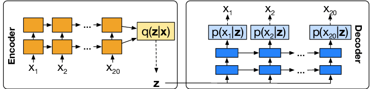

# lstm-vae-torch
A Simple Pytorch Implementation of LSTM-based Variational Autoencoder(VAE)

## Environment Setup
```bash
pip install -r requirements.txt
```

### LSTM+VAE Architecture


### MovingMNIST Example


## Reference
[1] Srivastava, Nitish, Elman Mansimov, and Ruslan Salakhudinov. "Unsupervised learning of video representations using lstms." International conference on machine learning. PMLR, 2015.

[2] Hsu, Wei-Ning, Yu Zhang, and James Glass. "Unsupervised domain adaptation for robust speech recognition via variational autoencoder-based data augmentation." 2017 IEEE Automatic Speech Recognition and Understanding Workshop (ASRU). IEEE, 2017.


[3] [AntixK/Pytorch-VAE](https://github.com/AntixK/PyTorch-VAE)

[4] [shobrook/sequitur](https://github.com/shobrook/sequitur)

[5]  https://joungheekim.github.io/2020/10/11/code-review/
